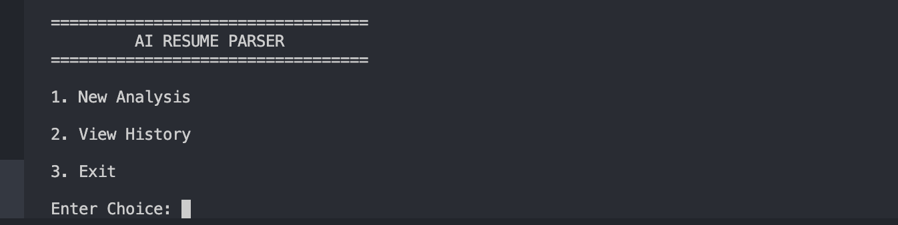
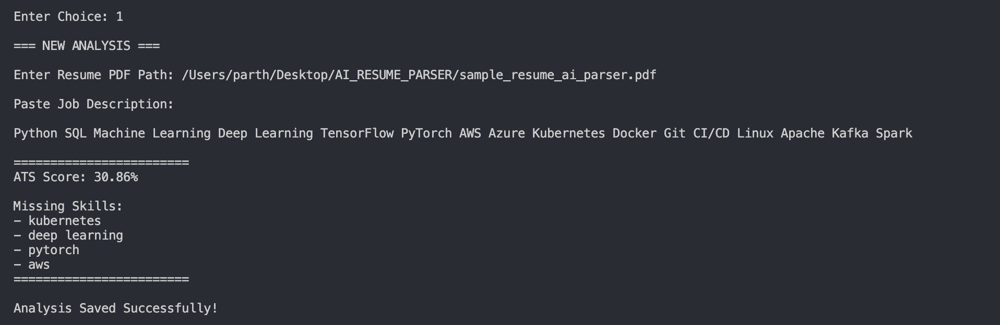
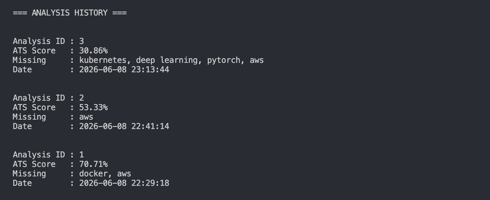

# AI Resume Parser & ATS Analyzer

A Python-based ATS (Applicant Tracking System) Resume Analyzer that parses PDF resumes, compares them against job descriptions, calculates ATS compatibility scores, identifies missing skills, and stores analysis history in MySQL.

---

## Overview

This project simulates a simplified Applicant Tracking System used by recruiters to evaluate resumes against job requirements.

The system extracts text from PDF resumes, matches candidate skills against job descriptions, calculates an ATS score, identifies skill gaps, and stores all analyses in a MySQL database for future reference.

---

## Key Features

- PDF Resume Parsing
- ATS Score Calculation
- Skill Gap Detection
- Job Description Matching
- Analysis History Tracking
- MySQL Database Integration
- Command Line Interface
- Persistent Analysis Storage

---

## Technology Stack

| Category | Technology |
|-----------|------------|
| Language | Python |
| Database | MySQL |
| PDF Processing | PyPDF2 |
| Data Handling | Pandas |
| Database Connector | mysql-connector-python |
| Output Formatting | Tabulate |

---

## Screenshots

### Main Menu



---

### ATS Analysis



---

### Analysis History



---

## Project Structure

```text
AI-Resume-Parser
│
├── main.py
├── resume_parser.py
├── ats_engine.py
├── database.py
├── reports.py
├── skills.py
├── requirements.txt
│
├── screenshots
│   ├── menu.png
│   ├── ats_result.png
│   └── history.png
│
└── sql
    └── schema.sql
```

---

## ATS Workflow

```text
Resume PDF
     │
     ▼
Text Extraction
     │
     ▼
Skill Identification
     │
     ▼
Job Description Matching
     │
     ▼
ATS Score Generation
     │
     ▼
Missing Skills Detection
     │
     ▼
MySQL Storage
```

---

## Installation

Clone the repository:

```bash
git clone https://github.com/parthh001/AI-Resume-Parser.git
cd AI-Resume-Parser
```

Install dependencies:

```bash
pip3 install -r requirements.txt
```

---

## Database Setup

Create the database:

```sql
CREATE DATABASE ats_resume_db;
USE ats_resume_db;
```

Execute:

```text
sql/schema.sql
```

Update database credentials inside:

```text
database.py
```

```python
host="127.0.0.1"
user="root"
password="password"
database="ats_resume_db"
```

---

## Running the Application

```bash
python3 main.py
```

Available options:

```text
1. New Analysis
2. View History
3. Exit
```

---

## Example Analysis

### Job Description

```text
Python Developer

Required Skills:
Python
SQL
Machine Learning
Docker
Git
AWS
```

### Output

```text
ATS Score: 70.71%

Missing Skills:
- docker
- aws
```

---

## Database Storage

Each analysis is stored with:

- Resume ID
- ATS Score
- Missing Skills
- Timestamp

This allows users to review previous analyses using the History feature.

---

## Current Skill Library

```text
Python
SQL
Java
C++
Machine Learning
Deep Learning
AWS
Docker
Kubernetes
Git
TensorFlow
PyTorch
Flask
Django
MongoDB
```

---

## Future Roadmap

### Version 2

- Streamlit Web Interface
- Drag-and-Drop Resume Upload
- ATS Score Visualizations
- Resume Ranking System
- Export Reports to PDF

### Version 3

- AI Resume Recommendations
- GPT-Based Resume Review
- Multiple Resume Comparison
- Job Recommendation Engine

---

## Repository

GitHub:

https://github.com/parthh001/AI-Resume-Parser

---

## Author

Parth Patil

---

## License

This project is intended for educational, learning, and portfolio purposes.
